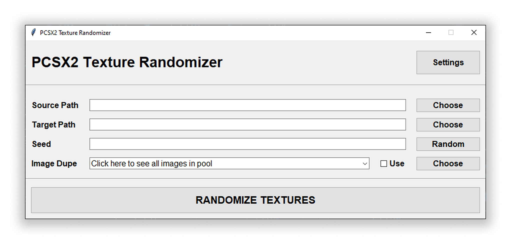
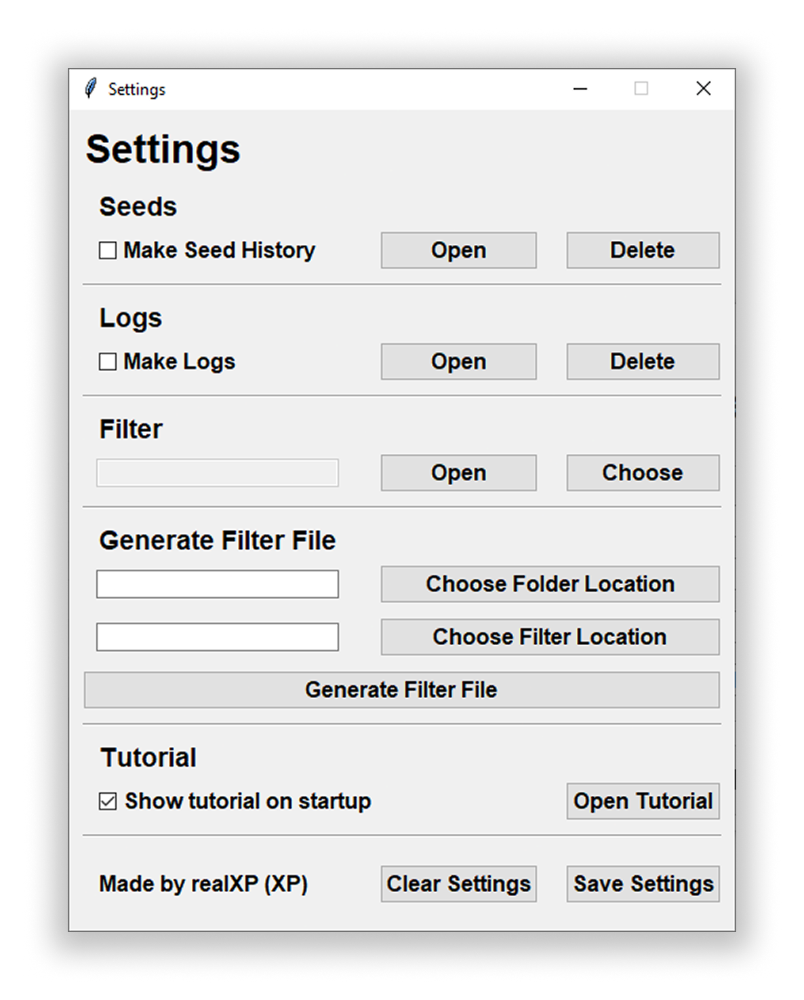

# PCSX2 Texture Randomizer
This is a simple program I made to randomize texture dumps from PCSX2.
Initially the program was a single file script and was made just for the purpose of randomizing Enthusia (game) textures, but this can be used in many other games



# Requirements
- You need `Python 3` installed on your system
- You need `Texture Replacement` enabled on PCSX2
    - To do that, Go to `Settings > Graphics`
    - Under `Graphics`, go to `Texture Replacement`
    - There you should see both your location for texture dumps and replacement, and settings to allow dumping and loading of textures
- The game's texture dump (You can usually download HD textures from the internet like in case of Gran Turismo 4 or Enthusia)

# Usage
To use this script, follow the steps
- Download the repository using the `Download` button
- Download the textures you want to randomize
    - Make sure the textures you want to randomize are in a separate folder and NOT in your `replacements` folder
- Open the `main.py` using Python (It should be in the `bin` folder)
- It should bring out a GUI interface
- In `Source Path` field, press `Choose` and select the directory where your textures are located
- In `Target Path` field, press `Choose` and select the directory where you want to rename and move the textures to
- Set a seed in the `Seed` field, or choose a random seed by pressing `Random` button
- If you want to use the Image Duper function, click on `Choose` under `Image Dupe` and select the images you want to be duped and be replaced as textures for the game, also check the `Use` Checkbox
- After you have set everything up, Click on the `Randomize Textures` or `Duplicate Textures` button, depending on which mode you are in
- It should hopefully start processing everything, and should be successful in its task
- You can enable `Texture Replacement` in PCSX2, and `Load Textures` to load these randomized textures

## Seeds
- To change the seed for the randomizer, you have multiple options
    - If you leave the `Seed` field empty, it will choose a random seed
    - If you click `Random` next to the `Seed` field, it will give you a random seed
    - You can input any text in the `Seed` field for a custom seed
        - For example, `694202167`, or `Genius Turismo 4` or `IWinChicane2` or `House In The Mountains that John built`
- The seed will also be saved in a `seeds.txt` file, stored in the same directory as `main.py`, which can be accessed via `Seed History` button

## Settings
- You can see all the settings by pressing the `Settings` button on the top right of the main window



### Logging
- You can enable logging of textures to see which textures is renamed to which
- You can enable this by checking the `Make Logs` checkbox
- The log will be saved in a `log.log` file, which will be stored alongside `main.py`
- You can access logs by clicking on the `Open` button
- You can delete logs by pressing `Delete` button

### Filter
- To add exception / filter for text textures, just include the `filter.txt` file in the same directory as the `main.py`
- You can also choose your own filter file or create one by pressing `Choose` or `Open` in the `Filter` section of `Settings`
    - It will open a Notepad file, where you can paste the texture names
    - Make sure the file names in the `filter.txt` is separated by new lines
    - Please only input the file names in the list, and not the entire paths for the files
  
### Generating Filter File
- You can also generate filter files in the `Generate Filter File` section
- In the first input box, put in the folder which contains the textures that you want to filter, or press `Choose Folder Location` button
- In the second input box, put in the folder where you want the `filter.txt` file to be saved, or press `Choose Filter Location` button
- Press the `Generate Filter File` button, and it should generate a `filter.txt` file
- You will also get an option to use it as your filter file for the project, which you can accept or reject

### Saving Settings
- You can save settings for the setup by checking the `Save Settings` button
- This will include
    - Source Path
    - Target Path
    - Filter Path
    - Seed
    - Data for both checkboxes
- When you click `Save Settings` button and it performs everything successfully, it will store the configuration in a `config.json` file, located alongside the `main.py` file
- Next time you load the program, it will load the settings
- To delete the configuration, just delete the `config.json`, or click on `Clear Settings`

### Tutorial
- There is a `Open Tutorial` button to access this `readme.md` file
- You can also uncheck the `Show Tutorial On Startup` button and save configuration to disable the pesky startup message popup

## Image Dupe
- This will allow you to set a single image or a pool of images as the texture for the entire game
- Click on `Choose` in the `Image Dupe` section in main window, and choose your image file(s)
- Check the `Use` checkbox alongside it
- It will create hard links for that image file in the `Target` folder
  
### Warnings
- Using Image dupe comes with a lot of risks
- As Windows only allows 1024 Hard links per file, where 1 is for the original file itself, the duping function makes temproary files in a temproary folder, just to make more hard links
- Hard links are not supported on a `FAT32` file system
- Hard links are not supported across different partitions of a drive
- Hard links, that might be in the `Recycling Bin` also count towards the limit. It is recommended you permanantly delete the files when deleting them

## Randomize Texture Button
- After everything is filled in, you can press the `Randomize Textures` or `Duplicate Textures` button
- In the command line, it will show you your progress
- Do not panic, the program's main window might freeze, it is normal behaviour (I do not want to go on a rant about multithreading in python)
- After the randomization process is done, you will get a message saying the same

## PCSX2 Setup
- After the script is finished, it should move the textures from the `dumps` folder to the `replacements` folder
- To see the changes, in PCSX2
    - Go to `Settings > Grahpics > Texture Replacements > Load Textures`
    - When you boot the game, you should see randomized textures
- To rerun the script or rerandomize the content, move the textures back to `dumps` folder and follow the steps again 

# Revert Textures
- To rever the textures back to normal, you can
    - Either delete the `replacements` folder where the textures are
    - Turn off `Load Textures` in PCSX2 Graphics Settings
- If you are using hard links, **please make sure to permanant delete all files in the replacement folder**

# Build
- Even though this project is completely runnable by just using a console and running Python on the `main.py` file, you can build this project too
- For this you will require `pyinstaller` from https://pyinstaller.org/
- To install pyinstaller, run
```bash
pip install pyinstaller
```
- It should install `pyinstaller` successfully
- Now open a command window in the `bin` folder of the project
- Type in the following command
```bash
pyinstaller --name "PCSX2 Texture Randomizer" --clean --specpath "../build" --distpath "../app" --workpath "../build" --onefile main.py
```
- This should generate a `PCSX2 Texture Randomizer` file in the `app` folder in root of the project

# About
This script was made by `real-xp`, better know as `XP`, along with big help from `Azullia`. I am not the most experienced with Python as a whole, so if I have made some rookie mistakes, please forgive me. No AI was used in any step of the development of the program, just pure brain stupidity and staring-at-documentation-for-hours. If you find any flaw or bugs, please tell me in the `issues` section of `GitHub`
